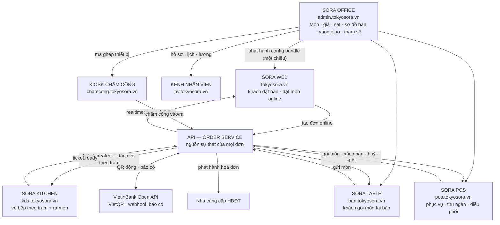
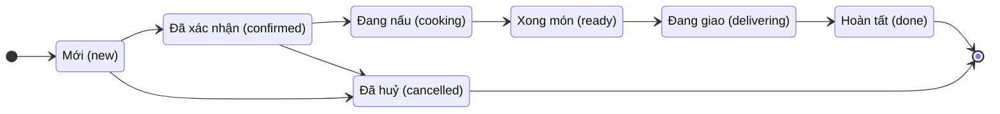
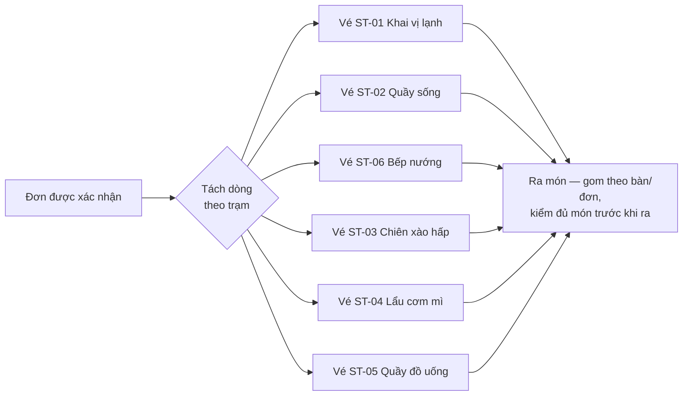

# 1 · Tổng quan hệ thống

Tokyo Sora là hệ thống vận hành nhà hàng nướng than, đa chi nhánh, chạy hoàn toàn
trên trình duyệt (chưa có app native). Hệ thống gồm **8 ứng dụng** dùng chung một
nền dữ liệu, phục vụ trọn vòng đời một bữa ăn: khách đặt → bếp nấu → thu ngân
chốt → sổ sách & báo cáo.

## 1.1 Tám ứng dụng — ai dùng gì

| Ứng dụng | Tên miền (production) | Cổng dev | Người dùng | Thiết bị |
|---|---|---|---|---|
| **Sora Web** | `tokyosora.vn` | `:3001` | Khách online — xem menu, đặt bàn, đặt món mang về/giao hàng | Điện thoại, máy tính của khách |
| **Sora Table** | `ban.tokyosora.vn/t/<token>` | `:5173` | Khách tại bàn — quét QR gọi món, tự thanh toán | Điện thoại của khách |
| **Sora POS** | `pos.tokyosora.vn` | `:5174` | Phục vụ, thu ngân, lễ tân | Tablet 11″ + máy thu ngân 22″ |
| **Sora Kitchen (KDS)** | `kds.tokyosora.vn` | `:5175` | Đầu bếp từng trạm, người ra món | TV 32–43″ + Android box, treo trong bếp |
| **Sora Office** | `admin.tokyosora.vn` | `:5176` | Chủ, quản lý chuỗi, kế toán, nhân sự, marketing | Máy tính văn phòng |
| **Kênh nhân viên** | `nv.tokyosora.vn` | `:5178` | Mọi nhân viên — xem lịch, công, phiếu lương của chính mình | Điện thoại cá nhân |
| **Kiosk chấm công** | `chamcong.tokyosora.vn` | `:5179` | Mọi nhân viên — chấm vào/ra ca | Tablet 10″ gắn cố định ở chi nhánh |
| **API** | `api.tokyosora.vn` | `:3000` | (Máy chủ — không có giao diện) | — |

Hướng dẫn chi tiết từng ứng dụng nằm ở các chương sau. Hướng dẫn **lắp đặt thiết
bị** tại quán (ghép máy, kiosk mode, máy in) xem [THIET-BI.md](../THIET-BI.md);
hướng dẫn **triển khai hạ tầng** xem [DEPLOY.md](../DEPLOY.md); chạy trên máy dev
xem [DEV.md](../DEV.md).

## 1.2 Sơ đồ kiến trúc tổng thể

**Bốn nguyên tắc xuyên suốt** (vi phạm là nguồn gốc của hầu hết lỗi vận hành):

1. **Office là nguồn duy nhất của cấu hình.** Danh mục món, giá, set, sơ đồ bàn,
   vùng giao, khung giờ nhận đặt, tham số thuế/phí đều khai ở Office rồi **phát
   hành** thành một bundle có version. Web · Table · POS · Kitchen chỉ đọc.
   Sửa dữ liệu mà chưa phát hành thì các app chưa thấy.
2. **Order Service là nguồn duy nhất của đơn.** Mọi app tạo/sửa đơn đều đi qua
   API, không app nào giữ trạng thái riêng.
3. **Bếp chỉ tiêu thụ vé** — không thấy giá tiền, không biết khách là ai.
4. **Mọi thay đổi trạng thái phát realtime** tới các app đang mở màn liên quan;
   mất mạng không được mất đơn (POS và KDS có hàng đợi cục bộ, tự gửi lại).

## 1.3 Vòng đời một đơn hàng

| Trạng thái | Ai đổi | Điều xảy ra |
|---|---|---|
| `new` | Khách tạo đơn trên Web | POS hiện thẻ đơn mới nhấp nháy ở dải điều phối |
| `confirmed` | Thu ngân bấm **Xác nhận** (hoặc đơn tại bàn **GỬI BẾP**) | Hệ thống tách dòng theo trạm, tạo vé bếp |
| `cooking` | Bếp bấm **Bắt đầu** | Khách thấy "Bếp đang làm" trên màn theo dõi |
| `ready` | Bếp bấm **Xong** | POS chuyển cột ở bảng điều phối |
| `delivering` | Thu ngân gán shipper | Khách thấy thông tin người giao |
| `done` | Thu ngân bấm giao xong / khách nhận | Đơn rơi khỏi bảng điều phối |
| `cancelled` | Thu ngân (kèm lý do) hoặc khách (trước khi nấu) | Bếp nhận lệnh huỷ vé |

**Quy tắc chặn quan trọng:** không huỷ được món **đã lên bếp** (`cooking` trở đi)
bằng thao tác thường — phải có quản lý duyệt bằng PIN, và mọi lượt huỷ đều ghi
nhật ký.

## 1.4 Định tuyến vé xuống bếp — 6 trạm

Mỗi món khai báo trạm bếp ở Office. Khi đơn được xác nhận, hệ thống **tách các
dòng theo trạm và tạo một vé cho mỗi trạm** (không phải một vé cho cả đơn).

| Trạm | Tên trên màn bếp | Kanji | Nấu gì |
|---|---|---|---|
| ST-01 | Khai vị lạnh | 鮮 | Sashimi, sushi, salad, tráng miệng |
| ST-02 | Quầy sống | 生 | Thịt ra sống đã cân — khách tự nướng |
| ST-03 | Chiên xào hấp | 揚 | Chiên, xào, hấp |
| ST-04 | Lẩu cơm mì | 鍋 | Lẩu, ramen, cơm, súp |
| ST-05 | Quầy đồ uống | 酒 | Toàn bộ đồ uống |
| ST-06 | Bếp nướng | 焼 | Nướng hộ, ra chín |

**Ra món** không phải một trạm — là màn K6 đọc vé của toàn chi nhánh để kiểm đủ
món trước khi ra.

Ba quy tắc định tuyến cần nhớ khi vận hành:

- **Món nướng chia 3 loại:** `SỐNG` (về ST-02 — khách tự nướng), `NƯỚNG` (về
  ST-06 — nướng hộ), `LINH HOẠT` (bàn có bếp → ST-02, bàn không bếp → ST-06).
  Nướng hộ không phụ thu. Vé ST-06 hiện dòng "Bàn … không có bếp" để đầu bếp
  hiểu vì sao món về trạm mình.
- **Set nổ thành từng món thành phần** rồi mới định tuyến — mỗi món về đúng trạm,
  vé giữ nhãn set để bếp biết chúng ra cùng lúc.
- **Chuyển bàn khác loại** (có bếp ↔ không bếp) giữa chừng → POS bắt xác nhận
  định tuyến lại, không tự đổi im lặng.

## 1.5 Vai trò & cách đăng nhập

Hệ thống có 13 vai trò (R0–R13), phân quyền theo ma trận ở
[tokyo-sora-ke-hoach-thiet-ke.md](../tokyo-sora-ke-hoach-thiet-ke.md) §4.2. Bốn
kiểu đăng nhập khác nhau tuỳ bề mặt:

| Bề mặt | Cách vào | Ai dùng |
|---|---|---|
| POS, KDS | **PIN 4–6 số trên thiết bị đã ghép** — PIN đứng một mình không dùng được | Phục vụ R1, thu ngân R2, lễ tân R3, bếp R4/R5, quản lý ca R7 |
| Office | **Email + mật khẩu** (không cần thiết bị ghép) | Chủ R10, quản lý chuỗi R11, kế toán R8, nhân sự R13, marketing R9 |
| Kênh nhân viên | **Link cá nhân** (Office cấp, hiện đúng một lần) **+ PIN của chính mình** | Mọi nhân viên |
| Kiosk chấm công | Thiết bị ghép sẵn; nhân viên **chạm tên → nhập PIN** | Mọi nhân viên |
| Sora Table | **Token QR theo phiên bàn** — hết hạn khi đóng bàn | Khách R0 |

Ba điều cần nhớ về quyền:

- **Quyền là hợp của vai trò người đăng nhập và vai trò thiết bị** họ đang đứng.
  PIN đúng nhưng gõ trên máy chưa ghép thì không vào được.
- **Phiên mở bằng link cá nhân có phạm vi `self`** — chỉ xem được dữ liệu của
  chính mình, kể cả khi người đó là thu ngân có quyền mở bàn. Đó là hành vi đúng.
- **Thao tác nhạy cảm cần người thứ hai duyệt** (huỷ món đã gửi bếp, giảm giá
  lớn, phiếu chi trên hạn mức, kỳ lương…). Không ai tự duyệt việc của mình.

## 1.6 Chi nhánh

Mọi bản ghi vận hành (đơn, ca, kho, công, quỹ) thuộc về **một chi nhánh**; danh
mục (món, công thức, giá) thuộc về chuỗi nhưng ghi đè được theo chi nhánh (giá
riêng, có bán không, trạm riêng). Trên Office:

- Nhóm **báo cáo** dùng bộ lọc chi nhánh chung (xem một chi nhánh, có nút so sánh
  chi nhánh dạng biểu đồ nhỏ — không gộp thành một số tổng).
- Các màn **cài đặt** theo chi nhánh (sơ đồ bàn, vùng giao, menu online, thiết
  bị, máy in…) có bộ chọn chi nhánh riêng ở đầu màn.
- Sửa danh mục cấp chuỗi sẽ cảnh báo "áp dụng cho N chi nhánh" trước khi lưu.

## 1.7 Thanh toán & hoá đơn điện tử

- **VietQR động:** mỗi lượt thanh toán sinh một mã QR nhúng **tài khoản định danh
  (VA) riêng của lần trả đó** — tiền vào VA nào là của bill đó, không phụ thuộc
  nội dung chuyển khoản. **Chỉ webhook ngân hàng báo có mới đổi trạng thái sang
  "đã trả"** — nút "Đã chuyển xong" của khách chỉ đổi màn hình chờ.
- **Hoá đơn điện tử:** khai cấu hình ở Office → A9 (MST, ký hiệu có chữ M,
  chứng thư số), phát hành và theo dõi ở Office → F3 — bill đã trả mà chưa có
  hoá đơn nằm trong hàng đợi để kế toán phát hành. Nguyên tắc: lỗi phát hành
  **không chặn khách ra về** — phát hành bù trong ngày.
- Đối soát ba vòng: **mỗi ca** (P14 — tiền mặt, COD, giao dịch VA chưa gán),
  **mỗi ngày** (F1 — hệ thống vs sao kê), **mỗi tháng** (khoá sổ F6).

> **Hiện trạng đấu nối (08/2026):** toàn bộ 139 màn của thiết kế đã dựng xong.
> Hai tích hợp ngoài đang chạy bằng bản giả lập — ngân hàng (`MockBankProvider`)
> và nhà cung cấp HĐĐT; kênh nhắn tin Messenger/Zalo và cầu in ESC/POS chưa dựng
> (in bill tạm dùng chức năng in của trình duyệt). Khi ký hợp đồng thật, thay
> adapter là chạy — giao diện người dùng không đổi. Danh sách tính năng màn
> hình chưa dựng nằm cuối mỗi chương (đáng chú ý nhất: nút phát hành cấu hình
> trên Office — xem chương 6 §6.11).
