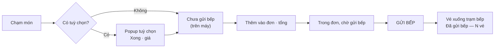
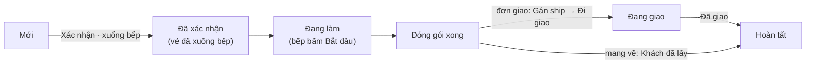

# 2 · Sora POS — phục vụ · thu ngân · lễ tân

POS chạy tại `pos.tokyosora.vn` trên tablet 11″ (phục vụ) và máy thu ngân 22″
(thu ngân — bật thêm dải điều phối). Máy phải được **ghép với chi nhánh** trước
khi dùng (người lắp máy làm một lần — xem [THIET-BI.md](../THIET-BI.md)).

## 2.1 Đăng nhập ca (P1)

1. Màn hình `Chọn nhân viên vào ca` — chạm ô tên của mình.
2. `Nhập PIN của {tên}` — gõ PIN 4 số trên bàn phím lớn, đủ 4 số tự vào.
   Nhầm người thì bấm **Chọn người khác**.

- PIN đứng một mình không dùng được: PIN đúng nhưng gõ ở máy **chưa ghép** sẽ
  không vào được. Máy chưa ghép chi nhánh hiện: *"Không tải được danh sách nhân
  viên. Kiểm tra máy đã ghép với chi nhánh chưa."* → gọi quản lý.
- **Mở ca** không nằm ở màn đăng nhập: nếu chi nhánh chưa mở ca, sơ đồ bàn hiện
  thẻ *"Chưa mở ca — mở ca trước khi thu tiền."* kèm nút **Mở ca**.

## 2.2 Thanh trên cùng — có mặt ở mọi màn

Bên trái là tên người đang đăng nhập. Bên phải, theo thứ tự:

| Nút | Mở ra | Ghi chú |
|---|---|---|
| **Đơn online** | Bảng điều phối (O8) | Kèm ` · N` khi có đơn đang chạy |
| **Đặt bàn** | Màn đặt bàn (R1/P13) | Kèm ` · N` lượt đặt hôm nay chưa ngồi |
| **Yêu cầu từ bàn** | Hàng đợi yêu cầu (P12) | Đổi màu nhấn khi có yêu cầu chờ |
| **Trạm thu ngân** | Bật/tắt dải điều phối (P16) | Chỉ nên bật trên máy 22″; máy nhớ lựa chọn |
| **Có bản mới — bấm để cập nhật** | Cập nhật PWA | Chỉ hiện khi có bản mới; máy **không tự tải lại** để không mất phiếu đang dựng |
| **Đóng ca** | Màn đóng ca (P14) | |
| **Đăng xuất** | Về màn đăng nhập | |

Banner mạng: `Mất mạng · vẫn gọi món được` / `Mất mạng · N lệnh đang chờ gửi` /
`Đang gửi N lệnh…`; nếu có lệnh hỏng: `N lệnh chưa gửi được — bấm để xử lý`
(viền đỏ). POS không có chuông/âm báo — theo dõi bằng con số trên các nút.

## 2.3 Sơ đồ bàn (P2) & mở bàn (P3)

Bàn xếp theo khu. Mỗi ô bàn ghi trạng thái bằng chữ: `Trống` · `Có khách` ·
`Đã gọi` · `Trả một phần` · `Đã trả · chờ dọn`. Bàn có bếp than mang dấu ▲;
bàn đã có khách đặt sắp tới có viền chấm + nhãn `Đặt 19:00`.

- **Chạm bàn trống** → hộp thoại `Mở bàn {mã}`: chọn **Số khách** → **Mở bàn**.
  Hộp thoại nhắc luôn kiểu bàn: *"Bàn có bếp than — món sống ra quầy sống để
  khách tự nướng."* hoặc *"Bàn không có bếp — bếp nướng hộ, món thêm khoảng 8
  phút."* (ảnh hưởng định tuyến bếp — xem chương 1 §1.4).
- **Chạm bàn có khách** → vào thẳng phiếu order của bàn.
- **Bàn đã dành cho khách đặt:** hộp thoại hiện khối vàng *"Bàn này đã dành cho
  {tên} lúc HH:MM…"* và nút đổi thành **Vẫn mở bàn** (màu đỏ) — bấm là mở đè và
  ghi nhật ký. Chỉ làm khi chắc chắn còn bàn khác cho khách đặt.

## 2.4 Gọi món tại bàn (P4–P8)

Màn gọi món chia 3 cột: **trái** — nhóm món (`⚡ Nhanh` = 20 món bán chạy, mở
sẵn); **giữa** — lưới món (món hết bị gạch chéo nhãn `Hết`, sắp hết ghi `còn N`,
món có tuỳ chọn bắt buộc có chấm vàng); **phải** — phiếu order.

Thêm món là **hai nhịp** — dễ nhầm nhất với người mới:

1. Chạm món → nếu có tuỳ chọn thì popup hiện ra, chọn xong bấm **Xong · {giá}**
   (nhóm có dấu `*` là bắt buộc). Món rơi vào mục `Chưa gửi bếp` — **mới nằm
   trên máy này**.
2. Bấm **Thêm vào đơn · {tổng}** → món vào đơn, mục `Trong đơn, chờ gửi bếp`.
3. Bấm **GỬI BẾP** (nút lớn dưới cùng) → vé tách theo trạm xuống bếp, toast
   `Đã gửi bếp — N vé`. Mất mạng thì `Đã xếp hàng, sẽ gửi khi có mạng`.

- Gọi thêm lần sau lặp lại đúng hai nhịp; hệ thống tự đánh `Đợt N`. Đợt giữ lại
  (cơm, tráng miệng…) nằm ở `Đợt đang chờ` — bấm **Ra đợt {N}** khi khách muốn.
- **Huỷ món:** bấm chữ **Huỷ** trên dòng món → nhập **Lý do** (bắt buộc) →
  **Huỷ món**. Món **đã lên bếp** thì cần quản lý duyệt tại chỗ: hộp thoại mọc
  thêm ô **Chọn người duyệt** + **PIN người duyệt** — *người duyệt phải khác
  người xin*. Đây là thao tác duy nhất không đi qua hàng đợi offline (phải có
  mạng).
- **Mã QR bàn** (góc trên phiếu order): hiện mã QR cho khách quét để tự gọi món
  và tự thanh toán trên điện thoại (chương 4). **Mỗi lần mở là cấp mã mới, mã cũ
  chết ngay** — đừng mở lại khi khách đang dùng.

## 2.5 Chuyển · ghép · tách bàn (P9)

Vào bằng nút **Chuyển · ghép · tách** ở chân phiếu order. Hai chế độ:

| Việc cần làm | Thao tác |
|---|---|
| Chuyển vài món sang bàn khác | **Tách theo món**: tick món → chạm bàn đích |
| Chuyển cả bàn sang bàn trống | Tick **hết** món → chạm bàn trống (giữ giờ ngồi, số khách) |
| Dồn hai bàn làm một | **Ghép cả bàn** → chạm bàn đích đang có khách |
| Khách góp tiền theo phần | **Tách theo %**: chọn 25/50/60/75% → **Thu phần này · {tiền}** |

Lưu ý:

- **Tách theo % không chuyển món đi đâu** — đơn vẫn là một bill của bàn; nó chỉ
  chia *lượt thu tiền*, phần còn lại nằm ở "còn phải thu".
- Món phải **đổi trạm bếp** khi chuyển bàn khác loại (có bếp ↔ không bếp) → hệ
  thống chặn lại hỏi: **Để nguyên** / **Chuyển và định tuyến lại**.
- Ba thao tác này cần mạng (không qua hàng đợi offline).

## 2.6 Tính tiền (P10) & đóng bàn

Bấm **Tính tiền** ở chân phiếu order. Màn hiện `Tổng đơn` · `Đã thu` ·
`Còn phải trả`.

- **Tiền mặt:** bấm các nút mệnh giá **+50.000 / +100.000 / +200.000 /
  +500.000** theo tiền khách đưa → **Thu đủ · {số}** → màn hiện thẻ xanh
  **Tiền thối khách**.
- **Khách chuyển khoản VietQR:** khách tự quét **mã QR bàn** và trả trong app
  trên điện thoại (chương 4). Tiền về hiện ở màn **đối soát** (P15) — nếu khách
  đã tự trả một phần, `Đã thu` trên màn tính tiền đã trừ sẵn.
- Trả đủ xong bàn chuyển `Đã trả · chờ dọn` — **bàn không tự đóng**. Dọn xong
  bấm **Đóng bàn {mã}** để trả bàn về `Trống` (token QR của khách cũng hết hạn
  lúc này).

## 2.7 Yêu cầu từ bàn (P12)

Khách bấm "Gọi nhân viên" trên điện thoại → yêu cầu hiện ở đây (nút **Yêu cầu
từ bàn** trên thanh trên cùng). Mỗi thẻ ghi bàn, thời gian chờ, nội dung; khách
xin tính tiền được gắn `Ưu tiên`, chờ quá 3 phút gắn `Chờ lâu`. Hai nút:
**Mở bàn** (nhảy vào phiếu order) và **Đã xử lý**.

## 2.8 Đơn online — điều phối (O8 · O9 · O12 · P16)

Thu ngân làm việc thường trực trên **dải điều phối** (bật nút **Trạm thu ngân**,
máy 22″): dải ghim bên phải, sống qua mọi màn, ba ngăn theo ưu tiên **Đơn
online → Đối soát → Yêu cầu bàn**, chân dải là sổ **COD** theo shipper. Cần nhìn
toàn cảnh hoặc lọc kênh thì mở **Bảng điều phối** (O8) — 5 cột trạng thái.

- **Xác nhận · xuống bếp** là bước quan trọng nhất — trước đó bếp chưa thấy gì.
  Thẻ đơn hiện giờ hẹn và đồng hồ đếm ngược; quá hẹn số chuyển âm + viền cam.
- **Gán ship:** chọn từ **sổ shipper quen** (một chạm) hoặc nhập `Tên` + `SĐT`
  mới. Ship là gọi thủ công — hệ thống không đấu nối app giao đồ ăn.
- **COD:** shipper về nộp tiền → chạm nút `{tên} · N đơn` ở chân dải → **Đã nhận
  đủ** (hoặc nhập `Số thực nhận nếu lệch`). Tiền COD tính vào két, khớp ở đóng ca.
- **Huỷ đơn** (ngăn kéo chi tiết O9): bắt buộc lý do — có 4 lý do sẵn *Khách đổi
  ý / Bếp báo hết / Sai đơn / Món lỗi*. Cảnh báo: vé bị rút khỏi màn bếp; khách
  đã chuyển khoản thì phải hoàn tiền tay.
- **Kênh ngoài (O12):** đơn GrabFood / ShopeeFood / Be **nhập tay** — chọn kênh,
  gõ `Mã đơn kênh`, tìm món (gõ không dấu được), **Thêm vào bảng điều phối**.
  Sau đó đơn đi chung một đường với đơn web.

## 2.9 Đặt bàn (R1 · R2 · R4)

Nút **Đặt bàn** trên thanh trên cùng. Hai chế độ xem: **Danh sách** (từng dòng:
giờ · tên · SĐT · số khách · kiểu chỗ · bàn · trạng thái) và **Trục giờ** (cột
30 phút × hàng bàn; **kéo thẻ** từ dải `Chưa gán bàn` thả vào hàng bàn để gán —
kéo được bằng ngón tay).

Chạm một đặt chỗ để mở chi tiết (R2):

- **Xác nhận** — khi đặt chỗ đang `Chờ xác nhận`.
- **Gán →** bàn hợp lệ (đúng kiểu chỗ, đủ sức chứa). Không có bàn hợp thì hệ
  thống nói thẳng: cần ghép bàn hoặc đổi kiểu chỗ với khách.
- **Đã đến · mở bàn {mã}** — mở phiên bàn nối thẳng vào đặt chỗ và nhảy vào màn
  gọi món. Chưa gán bàn thì nút khoá (`Gán bàn trước khi mở phiên`).
- **No-show** / **Huỷ** (bắt buộc lý do). Khách đã `Đã đến` thì hết huỷ được.
- **Ghi chú** ("Sinh nhật, dị ứng…") tự lưu và **đi theo sang phiên bàn**.

**Nhắc hẹn & no-show (R4)** — nút **Quá giờ & no-show**: hàng `Cần nhắc` (trước
24h và 2h) với nút gọi điện, **Chép liên kết** (gửi khách xác nhận một chạm qua
Zalo), **Đã nhắc** / **Không nghe máy**; hàng `Quá giờ` có nút **No-show** — bị
khoá (`Còn giữ bàn`) cho tới khi hết 15 phút giữ bàn sau giờ hẹn. *Nhắn tin tự
động chưa đấu nối — hiện nhắc bằng gọi điện, màn này ghi lại ai đã gọi.*

## 2.10 Đối soát thanh toán (P15) & đóng ca (P14)

**P15 — Đối soát thanh toán tại bàn** (vào từ màn đóng ca hoặc dải điều phối):
so khớp bill với giao dịch VietQR trong ngày, ba nhóm:

| Nhóm | Nghĩa | Nút xử lý |
|---|---|---|
| `Lệch số tiền` | Khách chuyển thiếu/thừa | **Chấp nhận** (bỏ qua phần thiếu) / **Yêu cầu bù** (phần thiếu quay lại bill của bàn) |
| `Chưa gán` | Tiền đã vào, chưa biết của bàn nào | **Gán vào bill** → chọn trong các bàn còn nợ tiền |
| `Đã khớp` | Không cần làm gì | — |

Banner đỏ nếu giờ cao điểm mà ngân hàng im hơi quá 15 phút trong khi có khách
đang chờ — kiểm tra mạng rồi đối soát lại.

**P14 — Đóng ca:**

1. Xem `Tiền đầu ca` → `Thu trong ca` (tiền mặt **+ COD shipper đã nộp**) →
   `Hệ thống ghi nhận`.
2. **Đếm két thực tế** bằng các nút mệnh giá (+500.000 … +10.000). Dòng
   `Chênh lệch` chỉ hiện **sau khi** đếm — cố tình để người đếm không nhìn số
   hệ thống mà đếm theo.
3. Kiểm khối `Chuyển khoản`: hệ thống vs sao kê; còn lệch/chưa gán thì bấm
   **Mở đối soát chi tiết** xử lý trước.
4. Ghi `Ghi chú ca` nếu có chuyện cần bàn giao → **Đóng ca** (nút khoá với nhãn
   `Đếm két trước đã` khi chưa đếm). Lệch vẫn đóng được — hệ thống ghi bút toán
   lệch quỹ và báo rõ.
5. Đóng ca xong máy **tự đăng xuất** — ca sau đăng nhập lại.

## 2.11 Khi mất mạng

- Vẫn mở bàn, gọi món, gửi bếp, thu tiền mặt được — lệnh xếp hàng, tự gửi khi có
  mạng, **không nhân đôi**. Banner trên cùng luôn nói rõ còn bao nhiêu lệnh chờ.
- Bốn việc **cần mạng**: huỷ món đã lên bếp (duyệt PIN), chuyển/ghép/tách bàn,
  và thao tác trên đơn online/đặt bàn.
- Khách **không tự thanh toán QR được khi mất mạng** — thu tiền mặt hoặc chờ.

## 2.12 Giới hạn của bản dựng hiện tại

Để khỏi tìm nút không tồn tại — các mục sau trong thiết kế **chưa dựng** trên POS
(08/2026):

- Tính tiền: chỉ có **tiền mặt** trên POS (VietQR là khách tự trả qua app bàn);
  chưa có thẻ/ví/ghi nợ công ty, voucher, giảm giá, ô SĐT tích điểm.
- **In bill và hoá đơn điện tử chưa có trên POS** (HĐĐT quản lý ở Office; in tạm
  bằng chức năng in của trình duyệt).
- Chưa có ô ghi chú theo món khi gọi hộ (ghi chú chỉ đến từ app khách).
- Chưa có chọn ca / nhập tiền đầu ca khi mở ca (tiền đầu ca đang là 0).
- Chưa có chuông/âm báo — nhìn số đếm trên các nút.
- Đặt bàn: chưa tạo được đặt chỗ mới từ POS, chưa có đặt cọc, nhắc hẹn chưa gửi
  tin tự động.
