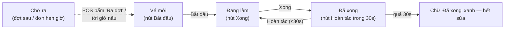

# 3 · Màn hình bếp (KDS) — đầu bếp · expo · bếp trưởng

Màn bếp chạy tại `kds.tokyosora.vn` trên TV 32–43″ gắn Android box, treo ở từng
trạm. Màn tự giữ sáng, chữ cỡ lớn, nút cao 72px để bấm được khi đeo găng.

## 3.1 Ghép màn vào trạm (K1)

Màn mới (hoặc sau khi **Ngắt ghép**) hiện `Ghép màn bếp — Nhập mã 6 số do quản
lý cấp`. Quản lý sinh mã ở Office → Quản trị → Thiết bị, chọn đúng **trạm** cần
ghim; mã sống 10 phút, dùng đúng một lần. Nhập đủ 6 số là tự gửi.

- **Trạm nằm trong thiết bị** — màn không có ô chọn trạm, không đổi trạm được từ
  giao diện. Muốn đổi trạm: bấm **Ngắt ghép** (góc phải thanh đầu) rồi ghép mã
  mới của trạm khác.
- Ghép nhầm mã là màn hiện vé của trạm khác — kiểm tra dòng kanji + tên trạm ở
  góc trái trên ngay sau khi ghép (xem thêm bài kiểm 5 phút trong
  [THIET-BI.md](../THIET-BI.md)).

Thanh điều hướng dưới tên trạm gồm 5 tab: **K2 Hàng vé · K3 Tổng món · K4 Chờ
ra · K5 Hết món · K6 Expo** (tab Chờ ra có chip cam đếm số vé đang chờ).

## 3.2 Hàng vé (K2) — màn làm việc chính

Vé xếp thành lưới **không cuộn** (số cột theo trạm: ST-02 sáu cột, ST-06 bốn
cột, còn lại năm); quá chỗ thì hiện dòng cam `Còn N vé nữa`. Vé trễ nhất tự nổi
lên đầu; vé `Đã xong` rơi xuống cuối.

Trên mỗi vé: `Bàn {mã} · Đợt {n}` (hoặc `Mang về · Đợt {n}`), mã vé, đồng hồ
`mm:ss`; từng dòng món ghi `{số lượng}×` (riêng **ST-02 hiện gram**), tên món in
hoa, nhãn set nếu là món trong set, và **ghi chú của khách màu cam — không bao
giờ bị ẩn**.

Mỗi vé chỉ có **một nút** tuỳ trạng thái:

Ba quy tắc phải thuộc:

- **Bấm `Xong` là trừ kho ngay** (nguyên liệu theo công thức món). **`Hoàn tác`
  không hoàn kho** — chỉ dùng khi bấm nhầm tay, và chỉ có hiệu lực 30 giây.
- Vé thuộc **đợt chưa ra** bấm nút sẽ bị từ chối: *"Đợt chưa ra — bấm 'Ra đợt
  tiếp' trước"* — nút **Ra đợt** nằm ở POS, phục vụ bấm khi khách muốn.
- **Không có chuông** — vé mới chỉ hiện lên, người đứng bếp phải nhìn màn.

**Đồng hồ vé** đếm từ lúc vé vào hàng, đổi màu theo *thang than hồng* — tỉ lệ
thời gian đã trôi so với thời gian chuẩn của món:

| Tỉ lệ thời gian | Màu | Nghĩa |
|---|---|---|
| dưới 40% | xám tro | Bình thường |
| 40–70% | đồng | Đang trong tầm |
| 70–100% | cam than | Sắp trễ |
| quá 100% | đỏ lửa + **viền vé nhấp nháy** | Đã trễ — ưu tiên ngay |

Đồng hồ tính theo giờ máy chủ (TV box sai giờ không làm vé đỏ oan) và dừng lại
khi bấm `Xong`.

## 3.3 Tổng món (K3) & Chờ ra (K4)

- **K3 Tổng món** — gộp các vé đang chạy theo món: `7× CƠM CHIÊN HẢI SẢN`, dưới
  liệt kê từng bàn `Bàn A4 ×2…` để nấu gộp một mẻ rồi chia. Ghi chú khách vẫn
  hiện đầy đủ.
- **K4 Chờ ra** — hai khối riêng:
  - `Đơn hẹn giờ — đếm ngược tới lúc phải bắt đầu`: đồng hồ **chạy ngược** tới
    giờ phải nấu (giờ hẹn trừ thời gian nấu). Còn hơn 5 phút viền xanh `Chưa tới
    giờ nấu`; còn ≤5 phút số chuyển vàng; quá mốc viền đỏ nhấp nháy `Phải nấu
    ngay`. Logic ngược với vé tại bàn — để đơn online không bị nấu sớm rồi nguội.
  - `Đợt sau — chờ phục vụ bấm "Ra đợt tiếp"`: không chạy đồng hồ.

## 3.4 Báo hết món (K5)

Màn liệt kê **món của trạm mình**. Mỗi món có hai nút:

| Nút | Kết quả |
|---|---|
| **Hết** (đỏ) | Món gắn `Hết đến cuối ca`, gạch tên, viền đỏ |
| **Còn N** | Hộp thoại `{món} còn mấy phần?` — chọn 1…20 → `Còn N phần`, *số phần trừ ngay lúc khách gọi, không đợi nấu xong*; bán hết N phần thì món tự khoá |
| **Mở lại** (khi món đang khoá) | Món bán lại bình thường |

Hiệu lực **tức thì trên mọi kênh**: menu trên điện thoại khách tại bàn, lưới món
POS và menu đặt online khoá món trong vài giây; khách có món đó trong giỏ sẽ
thấy thông báo "vừa hết — đã bỏ khỏi giỏ". Mọi lượt báo hết đều ghi nhật ký.

## 3.5 Expo (K6)

Màn **chỉ đọc** — không có nút "ra món". Hai khối:

- `Ra được — N đơn` (viền xanh, `Đủ món`): mọi vé của đơn/đợt đã xong — bê ra.
- `Còn chờ — N đơn`: dòng cam ghi đang chờ trạm nào (`Chờ ST-04 · ST-02`). Món
  đa trạm (ví dụ lẩu Sukiyaki = nồi ST-04 + khay thịt ST-02) được gom một dòng
  `Chờ đủ bộ`, từng nửa ghi `xong` / `đang làm` — chưa đủ bộ thì chưa ra.

## 3.6 Mất mạng, cập nhật, những điều nên biết

- Mọi nút bấm đi qua **hàng đợi cục bộ**: mất mạng vẫn bấm `Bắt đầu`/`Xong`
  được, lệnh tự gửi khi có mạng, không nhân đôi. Băng trạng thái trên cùng ghi
  rõ `Mất mạng · N lệnh đang chờ gửi` / `Đang gửi N lệnh…`; lệnh hỏng thì
  `N lệnh chưa gửi được — bấm để xử lý`.
- Mất kết nối máy chủ: *"Không nối được máy chủ. Vé đã hiện vẫn giữ nguyên, máy
  sẽ tự nối lại."* — vé trên màn không biến mất.
- Màn tự làm mới vài giây một lần; **có bản phần mềm mới thì chỉ tự cập nhật khi
  hết vé** (`Có bản mới — cập nhật khi hết vé`) — không tải lại giữa lúc đang có
  vé.
- Màn tự giữ sáng (wake lock). Mất điện bật lại là màn tự lên (cấu hình kiosk
  mode theo [THIET-BI.md](../THIET-BI.md)).
