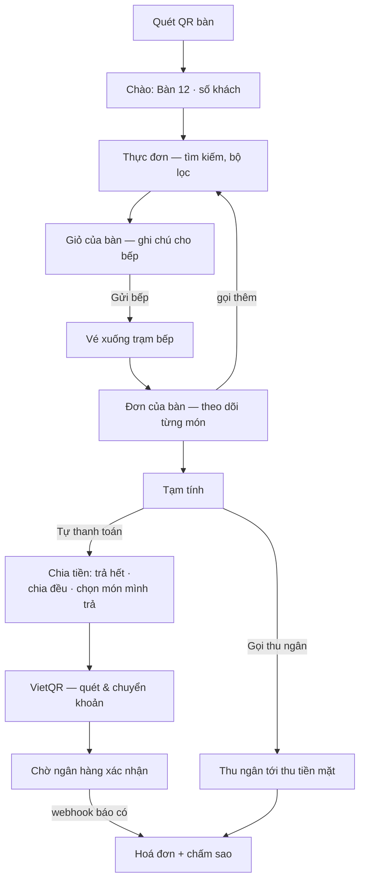

# 4 · Sora Table — khách quét QR gọi món & tự thanh toán

App chạy trên **điện thoại của khách**, không cần cài đặt: khách quét mã QR do
nhân viên cấp là vào thẳng bàn của mình. Chương này để phục vụ và thu ngân hiểu
khách đang thấy gì mà hướng dẫn — và biết ranh giới nào là cố ý.

## 4.1 Vào bàn

1. Phục vụ mở bàn trên POS → bấm **Mã QR bàn** (góc trên phiếu order) → đưa
   khách quét. *Mỗi lần mở hộp thoại là cấp mã mới và mã cũ chết ngay.*
2. Điện thoại mở `ban.tokyosora.vn/t/<token>` → hiện `Đang mở bàn…` → vào màn
   chào. Token được đổi lấy cookie phiên rồi **biến mất khỏi thanh địa chỉ** —
   khách chụp màn hình hay gửi link cho người khác cũng không vào được bàn.
3. **Bàn đóng là phiên hết hiệu lực ngay.** Mọi màn rơi về *"Chưa vào được bàn
   nào."* — khách quay lại sau khi bàn đã dọn thì nhờ nhân viên cấp mã mới.

Mã cũ/hết hạn: *"Mã trên bàn có thể đã cũ sau khi bàn được dọn. Nhờ nhân viên
in lại giúp bạn."*

## 4.2 Sơ đồ luồng của khách

## 4.3 Gọi món

- **Màn chào (T1):** `Bàn {mã}` + khu vực, dòng nhắc bàn có/không có bếp than
  ("Bàn không có bếp — bếp nướng sẵn, món ra chậm hơn khoảng 8 phút"), chọn
  **Mấy người ăn?** rồi **Bắt đầu gọi món**. Số khách gửi thẳng lên máy chủ (đi
  vào báo cáo bình quân đầu khách) — vượt sức chứa bàn sẽ bị từ chối.
- **Thực đơn (T2):** thanh nhóm món dính trên; nút **`+`** thêm thẳng vào giỏ;
  món có tuỳ chọn bắt buộc mang **chấm vàng** — bấm `+` sẽ mở chi tiết để chọn.
  Món hết gắn thẻ `Tạm hết`, nút khoá (không ẩn). **Bộ lọc** có 5 công tắc:
  Chay · Không cay · Không hải sản · Dưới 200k · Đang có sẵn.
- **Chi tiết món (T3):** tuỳ chọn (nhóm `*` là bắt buộc, tự chọn sẵn lựa chọn
  đầu), ô **Ghi chú cho bếp** (≤300 ký tự), số lượng, **Thêm · {giá}**.
- **Tìm món (T4):** gõ không dấu vẫn ra ("bo ba chi" → Ba chỉ bò).
- **Giỏ (T6):** sửa số lượng/xoá từng dòng, ô **Ghi chú chung cho bếp** (gắn
  vào món chưa có ghi chú riêng) → **Gửi bếp · {tiền}** → màn xác nhận
  `Đã gửi bếp N món` rồi tự quay về thực đơn.
- **Đơn của bàn (T8):** nhóm theo **đợt**, mỗi món có thanh trạng thái:
  `Chờ gửi bếp → Bếp đã nhận → Đang làm → Sắp ra → Đã ra` (món huỷ gạch
  ngang). Tự cập nhật mỗi 15 giây.
- **Gọi nhân viên (T9)** — mở được từ mọi màn (nút điện thoại trên cùng): 5 nút
  **Gọi phục vụ · Thêm than · Đá · nước · Xin tính tiền · Việc khác** → hiện ở
  màn *Yêu cầu từ bàn* của POS.

## 4.4 Tự thanh toán

- **Tạm tính (T10):** ghi rõ *"chưa phải hoá đơn"*. Hai nút: **Tự thanh toán**
  / **Gọi thu ngân**. Đã trả một phần thì hiện "Đã trả X · còn Y".
- **Chia tiền (T11):** ba cách — **Trả hết** · **Chia đều** (chọn mấy người,
  "Bạn trả một phần; những người còn lại quét mã của họ trên máy mình") ·
  **Chọn món mình trả** (T12 — món người khác đã nhận trả bị khoá, chống trả
  trùng).
- **VietQR (T13):** mã QR + số tài khoản (có nút chép) + số tiền. Nút
  **Đã chuyển xong** *chỉ đổi màn hình chờ* — không đánh dấu đã trả.
- **Chờ xác nhận (T14):** "Đang chờ ngân hàng xác nhận…"; quá 45 giây: "Lâu hơn
  thường lệ. Nhân viên sẽ tới xác nhận giúp bạn." Khách đóng màn được — kết quả
  vẫn ghi nhận. Khi ngân hàng báo có: `Đã nhận {tiền} — Cảm ơn bạn!`.
  - Khách chuyển **lệch tiền**: app báo "Nhân viên sẽ tới đối chiếu giúp bạn —
    chưa cần chuyển thêm" → thu ngân xử lý ở màn đối soát P15 (**Chấp nhận** /
    **Yêu cầu bù**).
  - Lượt trả **hết hạn**: "Tạo lại mã mới giúp bạn, tiền chưa bị trừ lượt này."
- **Hoá đơn (T15):** phiếu đầy đủ món, phí phục vụ, thuế, các lượt trả (tiền
  mặt/chuyển khoản kèm giờ). Bàn còn nợ thì ghi rõ "đây vẫn là bản tạm tính".
  Cuối trang là thẻ **"Bữa nay thế nào?"** — khách chạm sao là gửi ngay, nhận
  xét thêm tuỳ ý → đổ về màn *Phản hồi khách* (B13) trên Office.

## 4.5 Quy tắc an toàn & sự cố

| Tình huống | Hành vi của hệ thống |
|---|---|
| Khách bấm "Đã chuyển xong" nhưng chưa chuyển | Không có gì đổi — **chỉ webhook ngân hàng báo có mới ghi nhận tiền** |
| Bàn trả đủ | Bàn chuyển *Đã trả · chờ dọn*; **nhân viên đóng bàn**, không tự đóng; khách vẫn gọi thêm được (khoản mới cùng phiên) |
| Mất mạng khi đang gọi món | Giỏ vẫn thao tác được, món **tự gửi khi có mạng** (banner "Mất kết nối — món đã chọn sẽ tự gửi khi có mạng") |
| Mất mạng khi thanh toán | **Chặn hẳn** (màn 断): *"Thanh toán cần mạng ổn định. Vui lòng gọi thu ngân."* — lượt trả cần tài khoản định danh thật, không xếp hàng được |
| Bếp báo hết món đang nằm trong giỏ | Hộp thoại *"{món} vừa hết — đã bỏ khỏi giỏ của bạn"* + gợi ý chọn món khác |
| Khách gọi nhân viên khi mất mạng | Báo lỗi thẳng (gọi người thì không thể nằm chờ trong hàng đợi) |
