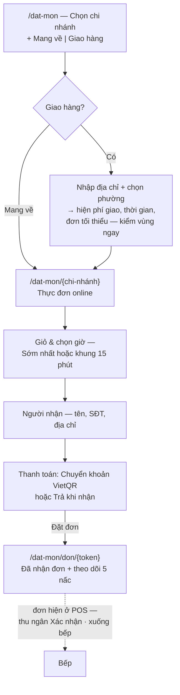
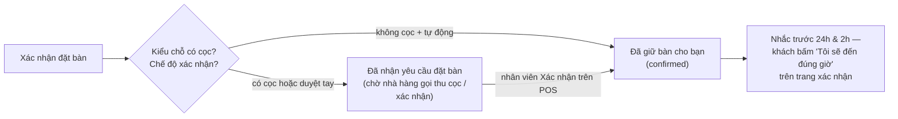

# 5 · Sora Web — website khách: đặt món online & đặt bàn

Website chạy tại `tokyosora.vn`, gồm các trang thương hiệu (W1–W9), luồng **đặt
món mang về / giao hàng** (`/dat-mon`) và luồng **đặt bàn** (`/dat-ban`).
Chương này cho quản lý và marketing: khách thấy gì, và **muốn sửa nội dung thì
sửa ở đâu**.

## 5.1 Các trang & nơi sửa nội dung

| URL | Trang | Nội dung chính |
|---|---|---|
| `/` | W1 Trang chủ | Hero "Bầu trời Tokyo, trên bếp than." + 2 nút **Đặt bàn** / **Xem thực đơn**; món ký; dải "Còn bàn tối nay" |
| `/thuc-don` | W2 Thực đơn | Toàn bộ món + giá theo chương, cùng nguồn dữ liệu hệ thống |
| `/thuc-don/{slug}` | W3 Chi tiết món | Trang giới thiệu món/set — nội dung soạn ở Office (M1 → "Trang giới thiệu trên web") |
| `/ve-chung-toi` | W4 Câu chuyện | Chuyện quán, hồ sơ bếp trưởng (chú ý: URL là `/ve-chung-toi`, không phải `/cau-chuyen`) |
| `/khong-gian` | W5 Không gian & chi nhánh | Mỗi chi nhánh: ảnh, địa chỉ, giờ mở, nút **Đặt bàn tại đây** |
| `/dat-ban` | W6 Đặt bàn | Luồng 3 bước — mục 5.3 |
| `/dat-ban/xac-nhan/{token}` | Xác nhận đặt chỗ | Trang một chạm từ link nhắc hẹn |
| `/uu-dai` | W7 Ưu đãi & Set | 3 ưu đãi + danh sách set |
| `/tin-tuc` | W8 Tin tức | Bài viết đăng từ Office (A8) |
| `/lien-he` | W9 Liên hệ & tuyển dụng | Danh bạ chi nhánh + vị trí tuyển dụng (A8) |
| `/dat-mon…` | O1–O7 Đặt món online | Mục 5.2 |

**Sửa gì ở đâu** — website đọc dữ liệu từ hệ thống, cache tối đa **60 giây**:

| Muốn đổi | Sửa ở |
|---|---|
| Giá, tên, mô tả, ảnh món; trang giới thiệu món | Office → **M1 · Món và set** (chương 6) |
| Món nào bán online, giá online, trần đơn mỗi khung | Office → **O11 · Menu online** |
| Vùng giao, phí giao, đơn tối thiểu, giờ ngừng nhận | Office → **O10 · Vùng giao & phí** |
| Khung giờ đặt bàn, cọc, trần suất, chặn ngày | Office → **R3 · Cấu hình nhận đặt** (+ giờ mở ở **A10**, sức chứa bàn ở **A3**) |
| Tin tức, vị trí tuyển dụng | Office → **A8 · Nội dung website** |
| Địa chỉ, SĐT, email, giờ mở chi nhánh | Office → **A10 · Chi nhánh** — đổ ra W5, W9, footer, chân hoá đơn |
| Chữ nghĩa thương hiệu (lời hứa, câu chuyện, lời dẫn chương) | File mã nguồn `apps/web/content/site.ts` — cần lập trình viên |

## 5.2 Đặt món mang về / giao hàng (O1 → O7)

Những chặn khách sẽ gặp (đều là hành vi đúng):

- **Ngoài vùng giao:** "Ngoài vùng giao của chi nhánh này." + nút **Đổi sang
  mang về**. Vùng khớp **theo tên phường** khách chọn.
- **Chưa đủ đơn tối thiểu:** "Vùng {x} nhận đơn từ {y} tiền món — còn thiếu
  {z}" — so trên tiền món, chưa gồm phí giao.
- **Khung giờ đầy** (`Kín chỗ`): trần đơn mỗi khung 15 phút đặt ở O11 — chống
  vỡ công suất bếp giờ cao điểm.
- Món `Tạm hết` không đặt được; món "ngon nhất trong 30 phút" có dòng nhắc chọn
  khung giờ gần.

Thanh toán & theo dõi:

- **Chuyển khoản VietQR** — "Đơn xuống bếp ngay khi ngân hàng báo có", hoặc
  **Trả khi nhận** (tiền mặt cho shipper / tại quầy).
- Trang theo dõi `/dat-mon/don/{token}` là trang cảm ơn kiêm theo dõi: thang
  5 nấc `Đã nhận đơn → Quán xác nhận → Bếp đang làm → Đóng gói xong → Đang
  giao`, tự cập nhật mỗi 10 giây. Chưa trả thì có nút **Trả bằng VietQR** ngay
  tại đây; nút **Đã chuyển xong** chỉ đổi màn chờ — tiền chỉ được ghi khi ngân
  hàng báo có.
- Khách nên **lưu đường dẫn theo dõi** (trang tự nhắc). Đơn huỷ hiện lý do +
  "Tiền đã trả sẽ được hoàn — quán gọi lại cho bạn."

Đơn đổ về POS (cột **Mới** ở bảng điều phối + dải trạm thu ngân) — thu ngân
**Xác nhận · xuống bếp** thì bếp mới thấy (chương 2 §2.8).

## 5.3 Đặt bàn (W6)

Luồng 3 bước: **Chi nhánh → Ngày & giờ → Xác nhận**.

1. **Chọn chi nhánh** — thẻ từng chi nhánh (giờ mở, số bàn, số bàn có bếp).
2. **Ngày & giờ** — dải 14 ngày; **Số khách** 1–10 (trên 10: "gọi giúp chúng
   tôi"); **Kiểu chỗ**: Bàn thường / Bàn nướng có bếp / Phòng riêng. Lưới
   **Giờ còn trống** là số thật từ sức chứa (A3) + cấu hình nhận đặt (R3):
   khung `Kín` mờ đi, không cho chọn rồi mới báo lỗi. Ngày bị chặn hiện lý do.
3. **Thông tin** — Tên, SĐT, ghi chú ("Sinh nhật, dị ứng, cần ghế em bé…").

Điểm riêng của màn này — **giữ chỗ mềm 10 phút**: từ lúc sang bước 3, góc màn
hiện `ĐANG GIỮ CHỖ CHO BẠN` + đồng hồ đếm ngược; hết giờ suất trả về lưới
("Hết mười phút giữ chỗ — suất đã trả về lưới, bạn chọn lại giúp nhé"). Hai
khách giành cùng suất thì người sau thấy khung xám ngay.

Kết quả tuỳ cấu hình:

- **Cọc** khai theo kiểu chỗ ở R3; có cọc thì suất luôn nằm chờ — *hệ thống
  chưa thu cọc trực tuyến*, nhà hàng gọi điện thu và bấm Xác nhận trên POS.
- Màn thành công có 4 lối: **Nhận xác nhận & nhắc hẹn qua Messenger** ·
  **Thêm vào lịch** (.ics) · **Xem lại & xác nhận đặt chỗ** · **Đặt thêm một
  bàn nữa**.
- Trang xác nhận `/dat-ban/xac-nhan/{token}` (link mà nhắc hẹn gửi): nút chính
  **"Tôi sẽ đến đúng giờ"**; muốn đổi giờ/huỷ phải **gọi điện** — cố ý không
  cho huỷ bằng một cú bấm.
- Đặt xong, suất hiện ngay trên POS (màn Đặt bàn) — lễ tân xác nhận, gán bàn,
  đón khách theo chương 2 §2.9.
