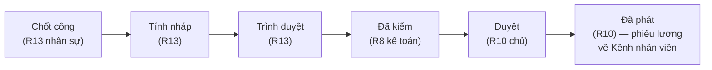
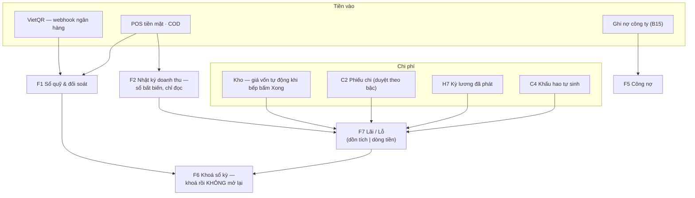

# 6 · Sora Office — hậu cần & quản trị

Office chạy tại `admin.tokyosora.vn` trên máy tính văn phòng, nền sáng. Người
dùng: chủ (R10), quản lý chuỗi (R11), quản lý ca (R7), kế toán (R8), quản lý
nhân sự (R13), marketing (R9), bếp trưởng (R5), thủ kho (R6).

## 6.1 Đăng nhập & khung màn hình

- Đăng nhập bằng **Chi nhánh + Email + Mật khẩu** (nút **Vào Office**) — không
  cần thiết bị ghép. **Phiên mở đúng một chi nhánh**; vai trò cấp chuỗi muốn
  làm việc ở chi nhánh khác thì đăng nhập lại.
- Cột trái là menu 9 nhóm dạng accordion (một nhóm mở tại một thời điểm; nhóm
  chứa trang đang xem tự mở). Ô **"Lọc menu…"** gõ là trải phẳng kết quả — gõ
  "kho" hay "S5" đều ra. Menu chỉ hiện màn mà vai trò của bạn dùng được.
- Route mặc định là **M1 · Món và set**.

**Ba cách nói "chi nhánh nào"** — nhầm lẫn phổ biến nhất khi mới dùng:

| Bộ chọn | Nhãn | Dùng ở | Ý nghĩa |
|---|---|---|---|
| Chi nhánh phiên | "Chi nhánh đang xem" (thanh bên) | Mọi màn vận hành/sổ sách còn lại | Phạm vi đăng nhập — đổi bằng cách đăng nhập lại |
| Bộ lọc báo cáo | Ô **"Chi nhánh"** | 11 màn đọc: B1–B10 và F7 | Đảo nhanh để so sánh; chọn một lần, cả nhóm báo cáo đổi theo |
| Bộ chọn cấu hình | Ô **"Chi nhánh đang cấu hình"** | 8 màn ghi: O10 · O11 · R3 · A3 · A4 · A5 · A6 · A9 | Ngồi một chỗ khai cho từng chi nhánh; khi khác chi nhánh đăng nhập sẽ có cảnh báo cam *"Khác chi nhánh đăng nhập"* |

## 6.2 Báo cáo kinh doanh (B1–B10)

Mọi màn báo cáo có bộ chọn kỳ + mốc so sánh, số nào cũng kèm chip chênh lệch
▲▼. Ô chưa có nguồn dữ liệu hiện gạch ngang kèm lý do — cố ý không hiện 0₫.

| Màn | Trả lời câu hỏi gì |
|---|---|
| **B1 · Hôm nay** | Màn mở đầu mỗi sáng: doanh thu, khách, BQ/khách, số đơn, food cost — so *hôm qua* và *cùng thứ tuần trước*; biểu đồ theo giờ; món đang bị bếp gạt; cảnh báo kho. Tự tải lại mỗi 60 giây |
| **B2 · Doanh thu** | Một con số cắt 5 lát: ngày, khung giờ, khu, hình thức, kênh, cách trả |
| **B3 · Phân tích món** | Ma trận 4 ô **Ngôi sao 星 · Bò sữa 牛 · Câu đố 謎 · Bỏ đi 去** + món dịch chuyển ô giữa các kỳ |
| **B4 · Giá vốn & lãi gộp** | Food cost từng ngày so mục tiêu; đóng góp lãi gộp theo nhóm (xếp theo **tiền**, không theo %) |
| **B5 · Hiệu suất bếp** | Thời gian vé vào hàng → xong theo trạm/khung giờ, tỉ lệ trễ SLA — **tách kênh tại bàn / online** |
| **B6 · Vòng quay bàn** | Thời gian ngồi, lượt/bàn/ngày; cột **Lấp đầy** lộ bàn đặt sai kích cỡ |
| **B7 · Nhân sự** | Doanh thu theo nhân viên, kèm số **Huỷ** và **Cần duyệt** đứng cạnh nhau — doanh thu cao mà duyệt nhiều là đang giảm giá để bán. Không có số lương nào ở đây |
| **B8 · Set & giảm giá** | Lãi thật của set (food cost theo **lựa chọn thật** của khách); BQ đơn có/không giảm giá |
| **B9 · Online & đặt bàn** | Đơn online theo giờ, tỉ lệ huỷ, thời gian giao; tỉ lệ no-show theo kiểu chỗ |
| **B10 · Trung tâm báo cáo** | Chọn kỳ một lần → **Xuất CSV** từng báo cáo (UTF-8 BOM, Excel không hỏng dấu). *Chưa có:* đặt lịch email, PDF, so liên chi nhánh |

Quy tắc đọc số: **doanh thu không gồm VAT và phí ship** (tiền thu hộ/trả hộ) —
riêng lát "theo cách trả tiền" cộng cả hai vì để đối soát với sổ quỹ F1.

## 6.3 Khách & khuyến mãi (B11–B15)

- **B11 · Khuyến mãi & voucher** — nút **Soạn chương trình** (giảm %, giảm
  tiền, tặng món, giá set khung giờ; điều kiện kênh/thứ/giờ/đơn tối thiểu; phát
  lô mã voucher). Marketing soạn được nhưng **bật chương trình phải có quản lý
  chuỗi/chủ duyệt bằng PIN** ngay trên màn (dải **Duyệt & bật**) — vì bật là
  đụng giá. **Một đơn chỉ hưởng một chương trình, không cộng dồn.**
- **B12 · Sổ khách** — hồ sơ gom **tự động theo SĐT** từ đặt bàn + đơn online +
  lượt thu tiền; không có nút "thêm khách". Hai tab *Hồ sơ & lịch sử* và
  *Điểm & hạng*. Vai trò không đủ quyền thấy SĐT bị che. **Điều chỉnh điểm
  tay** là cửa duy nhất đi vòng quy tắc "điểm chỉ sinh từ thanh toán" — bắt
  buộc lý do, luôn ghi nhật ký A7.
- **B13 · Phản hồi khách** — hàng đợi từ thẻ chấm sao sau thanh toán; nhận việc
  (**Tôi nhận việc này**), đóng khiếu nại phải ghi "đã xử lý thế nào"; quá hạn
  viền đỏ. Bảng "món hay xuất hiện trong bill bị chấm thấp" dùng để đi hỏi,
  không phải để cắt món.
- **B14 · Tích điểm & hạng** — cửa sửa tham số tích/đổi điểm và 3 hạng (chi
  tiêu 12 tháng trượt). Chỉ chủ sửa được; không có nút cộng điểm ở đây.
- **B15 · Khách doanh nghiệp** — hồ sơ MST, hạn mức nợ, điều khoản NET; bảng kê
  tuổi nợ 4 khoang; **Gạch nợ** khi tiền về. Quá hạn quá N ngày → **POS tự chặn
  ghi nợ mới**, cột "Quầy" nói rõ hồ sơ nào đang bị chặn.

## 6.4 Nhân sự (H1–H7)

Dòng chảy chuẩn **Lịch → Công → Lương**, mỗi bước khoá bước trước (sơ đồ tổng
ở chương 7 §7.3):

- **H1 · Hồ sơ nhân viên** — gắn hồ sơ vào **tài khoản đã có ở A1** (không tạo
  người mới ở đây): vị trí, cách trả lương (giờ/tháng), đơn giá, phụ cấp, tài
  khoản nhận lương. Nút **Link** cấp link Kênh nhân viên (chương 7 §7.1).
- **H2 · Xếp lịch tuần** — kéo ca vào lưới ngày × người, **Sao chép tuần
  trước**, rồi **Công bố lịch**. Quy tắc quyết định mọi thứ: **ca nháp thì nhân
  viên không thấy và giờ công chưa tính** — chỉ ca đã công bố mới được kỳ lương
  đọc.
- **H3 · Chấm công hôm nay** — bảng lệch **ba nguồn**: lịch xếp · công đã chấm
  (kiosk) · phiên đăng nhập POS/KDS. Khối "Cần đối chiếu" chỉ ra người có làm
  mà chưa chấm (sẽ bị trả thiếu) hoặc có chấm mà không thấy hoạt động.
- **H4 · Bảng công tháng** — giờ đã phân theo hệ số (thường / TC 150% / 200% /
  300%) — đúng con số kỳ lương dùng. Sửa tay bắt buộc lý do, ghi nhật ký; kỳ đã
  chốt công thì chỉ đọc — sai thì bút toán công kỳ sau.
- **H5 · Nghỉ phép & đổi ca** — một hàng đợi duyệt. Duyệt nghỉ thì ca rời lịch;
  **duyệt đổi ca thì hai ô lịch đổi chỗ và quay về nháp — phải công bố lại**.
- **H6 · Cơ chế lương** — giờ chuẩn, hệ số tăng ca (150/200/300%), khấu trừ
  (BHXH trên **lương cơ bản**). **Không có mục phạt tiền đi muộn** — luật lao
  động không cho phạt tiền; đi muộn trừ theo giờ không làm việc.
- **H7 · Kỳ lương** — 5 bước, không nhảy bước, ba vai trò:

  **"Chốt công" là mốc không quay lại** — sau đó bảng công của kỳ đóng băng.
  Không ai một mình đưa được tiền lương ra khỏi quỹ: nhân sự trình, kế toán
  kiểm, chủ duyệt và phát. Quản lý ca thấy *công* nhưng không bao giờ thấy
  *lương*.

## 6.5 Chi phí & tài sản (C1–C5)

- **C1 · Tổng quan chi phí** — cơ cấu theo khoản mục, cột **Ngân sách** nhập
  trực tiếp, vượt thì đỏ; nhắc "N phiếu chi đang chờ duyệt — chúng **chưa** vào
  Lãi/Lỗ".
- **C2 · Sổ phiếu chi** — cửa ghi chính; **quyền phụ thuộc số tiền**, form tự
  hiện bậc ngay khi gõ:

  | Số tiền | Bậc | Ai duyệt |
  |---|---|---|
  | ≤ hạn mức chi vặt | "Tự ghi — kế toán hậu kiểm" | Duyệt luôn khi ghi |
  | Khoảng giữa | "Cần kế toán duyệt" | Kế toán (R8) |
  | ≥ ngưỡng chủ duyệt | "Cần chủ duyệt" | Chủ (R10) |

  **Không ai tự duyệt phiếu chi của mình — kể cả chủ quán.** Chế độ **Tạm ứng
  nhân viên**: tiền ra nhưng *không phải chi phí* — tự khấu trừ vào kỳ lương.
  Mua sắm từ ngưỡng tài sản trở lên bị chặn ở đây — phải ghi ở C4.
- **C3 · Chi phí định kỳ** — khai tiền nhà/điện/nước; hằng tháng bấm **Sinh
  phiếu tháng N** để ra loạt phiếu **nháp** chờ điền số thật rồi duyệt (bấm lại
  không sinh trùng; chưa có bộ hẹn giờ tự chạy).
- **C4 · Tài sản & khấu hao** — ghi nhận tài sản, **Sinh khấu hao tháng** (đi
  thẳng vào sổ chi phí, không qua phiếu chi), **Thanh lý**.
- **C5 · Hoá đơn đầu vào** — sổ hoá đơn VAT mua vào, gắn với phiếu chi; cảnh
  báo "VAT khai trên phiếu mà chưa có hoá đơn" (mất quyền khấu trừ). F4 chỉ
  cộng tờ đánh dấu *được khấu trừ*.

## 6.6 Tài chính (F1–F7)

- **F1 · Sổ quỹ & đối soát** — tiền hệ thống ghi có khớp tiền thật không: tiền
  mặt theo ca (đầu ca → thu → chi → đếm thực → **Lệch**), chuyển khoản vs sao
  kê, khối "Còn treo — phải soi trước khi khoá ngày". **Không có nút đánh dấu
  tay** cho khoản treo — chỉ tín hiệu ngân hàng mới đóng được.
- **F2 · Nhật ký doanh thu** — sổ bất biến (trigger CSDL chặn sửa): bán, thu,
  giảm giá, tặng, huỷ, hoàn — kèm người thao tác, người duyệt, lý do. Sửa sai
  là bút toán ngược, không sửa dòng cũ.
- **F3 · Sổ hoá đơn điện tử** — khối "Bill đã trả mà chưa có hoá đơn" với nút
  **Phát hành** từng dòng; trạng thái Chờ/Đã phát hành/Lỗi/Đã huỷ/Đã thay thế;
  huỷ bắt buộc lý do, chọn "Huỷ và phát hành thay thế" hay "Chỉ huỷ". **Một đơn
  một hoá đơn**; hoá đơn huỷ giữ nguyên số đã cấp. Chưa khai ký hiệu ở A9 thì
  không phát hành được.
- **F4 · Báo cáo thuế** — VAT đầu ra − VAT đầu vào = VAT phải nộp; TNCN đã khấu
  trừ; khối đối chiếu hoá đơn vs doanh thu — lệch là đỏ kèm giải thích.
- **F5 · Công nợ** — phải trả NCC và phải thu khách doanh nghiệp (cùng nguồn
  với B15).
- **F6 · Khoá sổ kỳ** — màn có hệ quả lớn nhất Office: liệt kê **việc còn dở**
  và khoá nút cho tới khi xử lý hết; khoá xong thì **doanh thu, phiếu chi, bảng
  công, kỳ lương của kỳ ngừng nhận sửa và không có nút mở lại** — chỉ bút toán
  điều chỉnh kỳ sau. Chỉ khoá được tháng đã kết thúc.
- **F7 · Lãi / Lỗ** — hợp nhất tự động, **không dòng nào nhập tay**; hai chế độ
  **Dồn tích / Dòng tiền** (tạm ứng và trả nợ NCC là tiền ra nhưng không phải
  chi phí; khấu hao là chi phí nhưng không phải tiền ra). Ô **Prime cost** (giá
  vốn + nhân sự) báo động khi vượt 60% doanh thu. Dòng chưa có nguồn hiện trống
  kèm nhãn "Chưa có nguồn" — cố ý không giả vờ đầy đủ.

## 6.7 Món & thực đơn (M1–M11)

**M1 là cửa ghi duy nhất của trung tâm sản phẩm** — sửa ở đây, web · app bàn ·
POS · bếp · kênh online đổi theo trong vòng một phút. Không nhập món ở đâu khác.

| Màn | Việc chính |
|---|---|
| **M1 · Món và set** | Tìm không dấu, lọc; drawer sửa món: định danh → phân loại → giá (kèm **giá riêng chi nhánh** / **Tắt ở chi nhánh này**) → định tuyến bếp → tuỳ chọn → kênh bán → trình bày → **trang giới thiệu trên web** → trạng thái |
| **M5 · Tuỳ chọn** | Nhóm câu hỏi khi gọi món, dùng chung nhiều món; bắt buộc/tuỳ ý, chọn một/nhiều, chênh giá, công tắc **có trừ kho** (chỉ bật khi lựa chọn là nguyên liệu thật). Nhóm bắt buộc phải có ≥2 lựa chọn |
| **M4 · Công thức & giá vốn** | Xếp theo food cost giảm dần; sửa định lượng là thấy ngay "giá vốn tăng X · food cost lên Y%" **trước khi lưu**. Ngưỡng: <30% tốt · 30–38% cảnh báo · >38% báo động. Hao hụt % cộng thêm vào lượng xuất kho |
| **M7 · Nguyên liệu** | Khai một lần cấp chuỗi; cột **Quy đổi** sai là mọi công thức sai theo. Giá bình quân **không sửa tay được** — chỉ đổi qua phiếu nhập |
| **M8 · Bán thành phẩm** | Công thức mẻ (sốt, nước dùng): tiền mẻ ÷ sản lượng = giá đơn vị. Hai cột **Giá chuẩn** vs **Giá đang dùng** (từ lượt nấu thật S7) — lệch ≥10% thì nhắc |
| **M9 · Lịch sử công thức** | So hai bản bất kỳ (thêm/bỏ/sửa). Giá nguyên liệu đổi **không** sinh phiên bản — nhập hàng không phải sửa công thức |
| **M10 · Cây danh mục** | Kéo thả nhóm menu khách; đổi nhóm **không đụng định tuyến bếp** (trạm nằm trên món) |
| **M11 · Set & Combo** | Dải **giá vốn min–max** theo lựa chọn của khách — định giá theo **đầu đắt**; **Lịch bán** (thứ/khung giờ/từ–đến ngày) cưỡng chế lúc gọi món |

Ba trạng thái "không bán" dễ nhầm:

| Thao tác | Ở đâu | Phạm vi & thời hạn |
|---|---|---|
| **86 / báo hết** | Màn bếp K5 (hoặc B1 hiển thị) | Hết **trong ca**, tự hết hạn cuối ngày, khoá mọi kênh ngay |
| **Tắt ở chi nhánh này** | M1, khối giá | Chi nhánh đó ngừng bán tới khi bật lại |
| **Đang tắt (online)** | O11 Menu online | Chỉ tắt kênh mang về/giao — tại quán vẫn bán |

**Trang giới thiệu món trên web** (khối trong drawer M1): soạn nội dung trang
`/thuc-don/{mã}` — chương, lời dẫn, vị trí phần thịt, hương vị, độ cắt, gợi ý
gia vị… **Bỏ trống là hợp lệ ở mọi ô** — trang web tự lùi về bản gọn; nút
**Lưu nội dung trang web** / **Xoá nội dung giới thiệu**.

## 6.8 Kho & mua hàng (S1–S12)

| Màn | Việc chính |
|---|---|
| **S1 · Tổng quan kho** | Giá trị tồn, dưới định mức, lô sắp hết hạn; khối "Đang cản trở giá vốn" trỏ thẳng tới món chưa khai công thức / nguyên liệu chưa có giá |
| **S2 · Tồn kho** | Thanh mức tồn (càng cạn càng "nóng"); **Điều chỉnh** bắt buộc lý do, ghi bút toán riêng — sổ kho là sổ bất biến |
| **S3 · Nhà cung cấp** | Giá thoả thuận từng mặt hàng, **một mối chính** mỗi nguyên liệu |
| **S4 · Đơn đặt hàng** | Gợi ý đặt theo tốc độ tiêu thụ 14 ngày (`Đủ mấy ngày`, `Đang về`); gom theo mối chính → **Lập đơn**; đơn tự sang "Đã nhận đủ" |
| **S5 · Nhập kho** | **Cửa duy nhất làm đổi giá bình quân**; số lô + hạn dùng bắt buộc với hàng theo lô; cảnh báo lệch giá thoả thuận (không chặn) |
| **S6 · Xuất kho** | Tách **Xuất huỷ** (mất thật → hao hụt) và **Xuất nội bộ** (ăn ca — chi phí có ích); bắt buộc lý do; thủ kho cần người khác duyệt |
| **S7 · Sản xuất nội bộ** | Pha chế · **pha lóc** (1 tảng bò → nầm + dẻ sườn + hao) · đục keg; tổng tỉ lệ đầu ra phải đúng 100% — tiền phần hao nằm lại trong giá thành phẩm |
| **S8 · Kiểm kê** | Mở phiếu là **đóng băng tồn sổ** làm mốc; dòng trống = *chưa đếm*, không phải 0; **Chốt kiểm kê** cần người khác duyệt — chênh lệch thành chi phí ngay lúc bấm |
| **S9 · Lô & hạn dùng** | Xếp hạn gần trước (FEFO); **keg đã đục tính hạn từ ngày đục**, không theo vỏ |
| **S10 · Chuyển kho** | Xác nhận hai đầu; **nhận thiếu thì ghi hao ở bên gửi** |
| **S11 · Báo cáo hao hụt** | Công thức đòi vs thực tế xuất; khối riêng **bia tươi** (rót lý thuyết vs keg thực dùng); chênh âm thường là công thức khai thừa |
| **S12 · Thẻ kho** | Mọi bút toán của một mặt hàng, tồn luỹ kế từng dòng |

## 6.9 Kênh online & đặt bàn (O10 · O11 · R3)

- **O10 · Vùng giao & phí** — vùng khớp **theo tên phường**; mỗi vùng: phí,
  đơn tối thiểu, thời gian; một phường chỉ thuộc một vùng. Panel **Giờ ngừng
  nhận đơn** riêng cho mang về / giao hàng.
- **O11 · Menu online** — trần đơn mỗi khung 15 phút, thời gian bếp cần trước;
  công tắc bán online + **giá online** từng món (trống = giá tại quán).
- **R3 · Cấu hình nhận đặt** — chế độ xác nhận **tự động / duyệt tay**; 11 tham
  số thời lượng & giữ chỗ (giữ chỗ mềm 10′, giữ bàn 15′, thời lượng bữa…); trần
  suất và **tiền cọc theo kiểu chỗ**; **chặn ngày** (không huỷ suất đã nhận —
  màn báo số suất đang có để gọi từng khách). Lưu ý khối "Hai thứ không nằm ở
  đây": giờ nhận đặt lấy từ **giờ mở cửa A10**, sức chứa lấy từ **A3**.

## 6.10 Quản trị (A1–A10)

| Màn | Việc chính |
|---|---|
| **A1 · Tài khoản** | **Cửa duy nhất tạo người**: email + mật khẩu (vào Office) và PIN (vào POS/KDS/kiosk) trên cùng một tài khoản; lưới vai trò × chi nhánh. Không có nút xoá — người nghỉ chuyển "Đã ngừng". Đổi mật khẩu/PIN cắt mọi phiên đang mở |
| **A2 · Vai trò & quyền** | Màn **đọc** ma trận quyền (✓ / △ cần duyệt / –) + hạn mức theo vai trò + ai đang giữ vai trò nào. Ma trận nằm trong mã nguồn — thêm quyền là việc của bản thiết kế |
| **A3 · Khu vực & bàn** | Khai khu, bàn: loại chỗ (thường / nướng có bếp / phòng riêng), loại bếp, sức chứa min–max. Ba thuộc tính đổ thẳng vào W6, định tuyến bếp và lưới khung giờ |
| **A4 · Thiết bị** | Sinh **mã ghép 6 số** (sống 10 phút, dùng một lần) cho 5 loại máy: Tablet phục vụ · Máy thu ngân · **Màn bếp (bắt buộc ghim trạm)** · Kiosk chấm công · Cầu in. Nút **Ngắt máy** cắt cả token thiết bị lẫn phiên đang mở — máy mất là ngắt từ xa ngay |
| **A5 · Máy in** | Khai máy in bill/tem theo trạm, địa chỉ LAN, mẫu in. *Sửa xong phải phát hành lại bundle cấu hình* (xem 6.11) |
| **A6 · Trung tâm tham số** | Một sổ cho mọi ngưỡng/hệ số của hệ thống, nhóm theo mảng, mỗi dòng có chú thích hệ quả + lịch sử ai đổi. Hai nút lưu: **"Lưu cho chuỗi"** / **"Chỉ chi nhánh này"** (+ **Bỏ ghi đè**). Hiệu lực ngay, không cần triển khai lại |
| **A7 · Nhật ký thao tác** | Sổ bất biến mọi hành động nhạy cảm; lọc theo ngày/hành động/người; 50 dòng/trang |
| **A8 · Nội dung website** | Hai tab **Tin tức** và **Tuyển dụng**; bài giữ nháp được. Giá món sửa ở M1, địa chỉ/giờ mở sửa ở A10 — không ở đây |
| **A9 · Hoá đơn điện tử** | Phần chuỗi: MST, nhà cung cấp HĐĐT, chứng thư số (đếm ngày hết hạn); phần chi nhánh: **ký hiệu 6 ký tự có chữ M** + công tắc bật phát hành. Khai ở đây, phát hành ở F3 |
| **A10 · Chi nhánh** | Tên, SĐT, địa chỉ, email, **giờ mở cửa** — sửa một chỗ đổ ra website, chân hoá đơn, và là **nguồn dựng lưới giờ đặt bàn** (gõ sai giờ mở là chi nhánh ngừng nhận đặt) |

## 6.11 Giới hạn của bản dựng hiện tại (08/2026)

- **Nút "Lưu & phát hành" cấu hình chưa có trên Office.** Máy chủ đã có sẵn
  lệnh phát hành bundle (và POS còn nhắc "Vào Office bấm 'Lưu & phát hành'"),
  nhưng Office chưa dựng nút — hiện phát hành do kỹ thuật chạy lệnh
  (`db:dev-bootstrap` trên máy dev). Các màn cần phát hành lại sau khi sửa: A3
  sơ đồ bàn, A5 máy in, M1/M10/M11 phần cờ kênh.
- **Luồng duyệt bằng PIN trên Office mới có ở B11 (bật khuyến mãi).** Các chỗ
  khác vượt hạn mức (phiếu chi của quản lý ca, điều chỉnh tồn của thủ kho, huỷ
  hoá đơn) hiện báo *"cần người duyệt, mà luồng duyệt bằng PIN chưa có trên
  Office"* — tạm thời để người có quyền cao hơn tự thao tác.
- **B10** chưa có đặt lịch email, xuất PDF, so sánh liên chi nhánh (đã có CSV).
- **C3** chưa tự sinh phiếu hằng tháng — phải bấm nút **Sinh phiếu tháng N**.
- Ngân hàng và nhà cung cấp HĐĐT đang chạy **bản giả lập** — màn hình và thao
  tác không đổi khi đấu nối thật.
