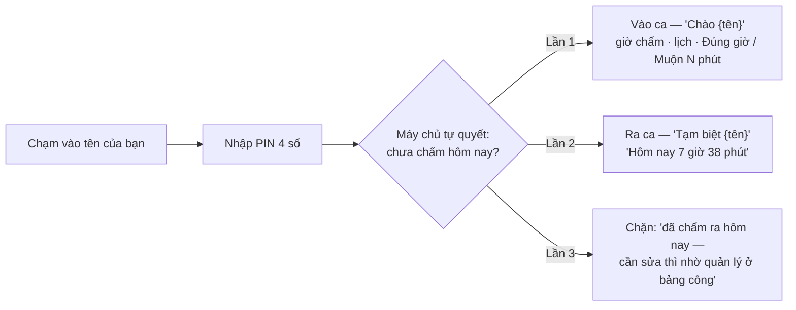
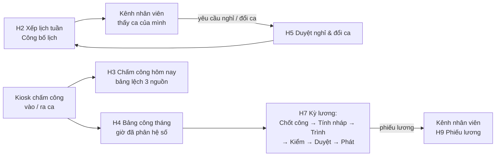

# 7 · Kênh nhân viên & kiosk chấm công

Hai bề mặt dành cho **mọi nhân viên** (phục vụ, bếp, thu ngân…): xem lịch —
công — phiếu lương của chính mình trên điện thoại, và chấm công vào/ra ca tại
quán. Chúng là hai app tách biệt vì hai vùng tin cậy khác nhau: điện thoại cá
nhân mang đi khắp nơi, kiosk gắn cứng ở chi nhánh.

## 7.1 Kênh nhân viên (`nv.tokyosora.vn`)

### Cấp link (việc của quản lý nhân sự)

Office → **Nhân sự → H1 Hồ sơ nhân viên** → bấm **Link** ở hàng của người cần
cấp → hộp thoại `Link cá nhân của {tên}` → **Chép link** và gửi cho nhân viên
qua Zalo.

- **Link chỉ hiện đúng một lần** — đóng hộp là không xem lại được; mất thì cấp
  lại. **Cấp lại làm link cũ chết ngay**, kể cả đang mở trên máy khác.
- Link là yếu tố *sở hữu* (mỗi người một link), PIN là yếu tố *biết* — đúng cặp
  mà POS đang dùng.

### Nhân viên vào lần đầu

1. Bấm link `…/nv/{token}` trên điện thoại → máy tự nhớ, địa chỉ token biến
   mất khỏi lịch sử.
2. `Nhập PIN của bạn` — *"Cùng mã PIN bạn dùng ở quán"*, 4 số tự gửi. Sai PIN
   quá 5 lần trong một phút thì khoá 5 phút.
3. Từ đó về sau mở app chỉ cần PIN (phiên sống 12 giờ). Máy của người khác thì
   bấm `Đây không phải máy của tôi`.

Nếu thấy *"Link không còn hiệu lực. Xin quản lý cấp lại."* — có link mới được
cấp, xin lại là xong.

### Hai màn duy nhất

**Lịch & công (H8):**

- **Lịch tuần** — chuyển tuần bằng `‹ ›`; chỉ hiện **ca đã công bố** (ca nháp
  của quản lý thì chưa thấy). Ca ghi giờ, tên ca, và chi nhánh nếu làm nơi khác
  chi nhánh chính.
- **Bảng công** — giờ công tháng (`176g30`), tăng ca thường/ngày nghỉ/lễ, danh
  sách từng ngày. Ba dòng cảnh báo quan trọng:
  - *"Còn N ca chưa chấm ra. Nhớ bấm ở kiosk trước khi về — ca chưa chấm ra thì
    chưa vào bảng công."*
  - *"Ngày có ca mà không có công: …"*
  - *"Kỳ lương … đã chốt công — giờ công trong khoảng đó không đổi nữa."*
  - Ngày do quản lý sửa tay có ghi rõ ai sửa, lý do.
- **Gửi yêu cầu nghỉ / đổi ca** — 4 loại: Nghỉ phép · Nghỉ ốm · Nghỉ không
  lương · Đổi ca (đổi ca phải chọn **Người nhận ca**); lý do bắt buộc. Yêu cầu
  đổ vào hàng đợi duyệt của quản lý (H5); trạng thái `Chờ duyệt / Đã duyệt /
  Từ chối` xem ở khối **Yêu cầu của tôi**.

**Phiếu lương (H9):** chọn kỳ → các dòng **Cộng** (lương theo công, tăng ca
`6g00 × 150%…`, phụ cấp, thưởng) và **Trừ** (bảo hiểm, thuế TNCN tạm khấu trừ,
tạm ứng) → **Thực lãnh**. Phiếu chỉ hiện **sau khi kỳ lương được duyệt**. Màn
hoàn toàn chỉ đọc — *"Thấy số chưa đúng thì nhắn quản lý nhân sự — kỳ đã chốt
không sửa ngược, sai sẽ được cộng/trừ ở kỳ sau."*

### Ranh giới phạm vi `self` (cố ý)

Phiên mở bằng link cá nhân **chỉ xem được dữ liệu của chính mình** — kể cả thu
ngân hay bếp trưởng cũng không mở được màn vận hành nào từ điện thoại:
*"Kênh nhân viên chỉ mở lịch, công và phiếu lương của chính bạn. Việc quản lý
cần đăng nhập ở máy của quán."* Chấm công từ đây cũng bị chặn — phải ra kiosk.

## 7.2 Kiosk chấm công (`chamcong.tokyosora.vn`)

Tablet gắn cố định ở lối vào khu nhân viên. **Chi nhánh nằm trong chính cái
máy** — đó là toàn bộ cơ chế "không chấm hộ từ ngoài". Lắp đặt và ghép máy (mã
6 số loại *Kiosk chấm công*, sinh ở Office → A4 Thiết bị) xem
[THIET-BI.md](../THIET-BI.md).

### Chấm công

- Người bấm **không chọn vào hay ra** — máy chủ tự quyết theo bản ghi trong
  ngày. Màn chào tự tắt sau 6 giây.
- Đi muộn dưới 5 phút vẫn hiện `Đúng giờ` (khoan dung đúng bằng máy chủ tính
  công). Không có ca trong lịch vẫn chấm được, màn ghi *"quản lý sẽ đối chiếu
  lại"*.
- Làm nhiều chi nhánh: chấm được ở nơi mình **có ca hôm đó**; chấm nhầm chi
  nhánh sẽ bị báo *"Hôm nay bạn không có ca ở chi nhánh này"*.
- Sau **mỗi** lượt chấm máy tự đăng xuất — tablet đứng ở lối vào, không phải
  máy của ai. Chọn tên rồi bỏ đi thì 20 giây sau màn tự về lưới tên.

### Khi có chuyện

| Tình huống | Máy nói | Việc cần làm |
|---|---|---|
| **Mất mạng** | `Mất mạng — gọi quản lý, đừng bỏ ca chưa chấm` | Quản lý ghi công tay ở H4 kèm lý do. Kiosk **cố ý không chấm offline** — lượt chấm không tới máy chủ thì không phải là lượt chấm |
| Sai PIN nhiều lần | `Nhập sai PIN quá nhiều lần. Thử lại sau N phút.` | Chờ hết khoá (5 phút) |
| Kỳ lương đã chốt công | `Kỳ lương … đã chốt công. Sai thì ghi bút toán công ở kỳ sau, không sửa ngược.` | Báo quản lý nhân sự |
| Quên chấm ra hôm trước | Bảng công báo "ca chưa chấm ra" | Nhờ quản lý sửa công tay (có lý do, ghi nhật ký) — **ca chưa chấm ra chưa vào bảng công** |

### Chống chấm hộ — ba lớp đang chạy

1. **PIN riêng từng người** (kiosk chỉ hiện chấm tròn, không hiện số).
2. **Máy gắn cứng chi nhánh** — mang kiosk ra ngoài là nó thành vô dụng.
3. **Đối chiếu chéo** ở Office H3: có phiên POS/KDS mà không chấm công → nhắc;
   có chấm công mà không có hoạt động nào → cảnh báo.

*Ảnh chụp lúc chấm (tuỳ chọn trong thiết kế) chưa có trong bản dựng này.*

## 7.3 Phía quản lý — vòng khép Lịch → Công → Lương

Dữ liệu từ hai bề mặt này chảy về Office (chi tiết chương 6 §6.3):

Nguyên tắc xuyên suốt: **lương tính từ công thực tế đã chấm, không từ lịch
xếp** — vì vậy "chưa chấm ra thì chưa vào bảng công" không phải lỗi vặt, nó là
tiền của người làm.
